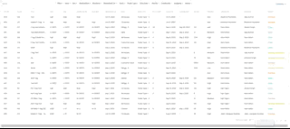

# Simplified-UI Angular Material Library

simplified-ui is an extension of [Angular Material Library](https://github.com/angular/components) with support for lazy loading table, lazy loaded select, currency input, secondary navigation pages and many more components.

## Getting Started

NPM

```
npm install --save simplified-ui
```

## Demo

Todo

Lazy loaded Mat Table


## Contributing

Contributions are welcome. Since this is a relatively new repository, we have various issues for which we are looking for help. The first and foremost priority is to build a demo site and usage instructions. You can start by looking at issues with label `Help wanted` or creating new Issue with proposal or bug report.

## Maintainers

[Ishmeet Sethi](https://github.com/sethi-ishmeet)

[Prabhpahul Singh](https://github.com/prabhpahul)
